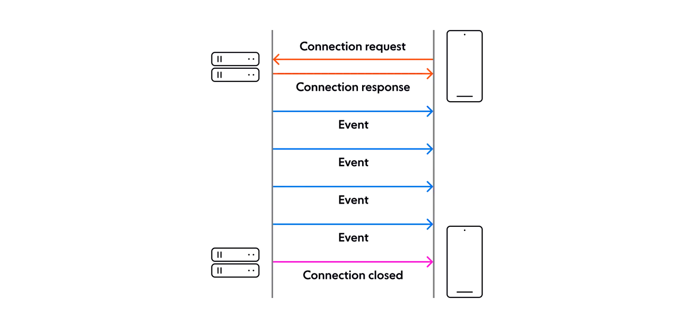
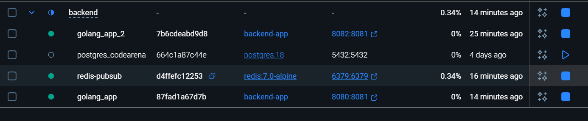

# Global Alert System (Cyber Alert Nepal)

A real-time notification system that delivers security alerts (breach, phishing, threat intel) instantly to user dashboards without requiring page refreshes.

---

## 1. Technology Stack

### Frontend
- React
- TypeScript
- Server-Sent Events (SSE)

### Backend
- Go
- Chi HTTP Router
- Redis (Pub/Sub)
- SSE over HTTP

---

## 2. Problem Statement

Cyber Alert Nepal requires a system that can notify users **immediately** when a security incident is detected. The solution must support:

- Real-time delivery
- Multiple concurrent user sessions
- High notification throughput (100+ events/sec)
- Scalability across multiple backend instances

---

## 3. High-Level Architecture


## 4. Design Descision 

1. why SSE over WS 
in our GLOBAL ALERT, we need to provide notification without refreshing the page for the dashboard. From this what i can assuse is that the connection is oneway between client and server , server sends the notification to the client.

- One-directional (server → client) communication fits the use case
- Built-in browser support
- Automatic reconnection handling
- Lower operational and implementation complexity
- HTTP-based and proxy-friendly

WebSockets were not chosen because their bidirectional nature is unnecessary for alert delivery and adds avoidable complexity.

**References**
- https://ably.com/blog/websockets-vs-sse
- https://www.reddit.com/r/node/comments/tfct4e/sse_or_websockets_for_push_notifications/

**SSE**



## 5. Pub/Sub Architecture (Redis)

Redis Pub/Sub is used to ensure notifications propagate across **multiple backend instances**.

### Why Redis Pub/Sub?

- Decouples alert producers from consumers
- Enables horizontal scaling
- Ensures consistent delivery across nodes
- Simple and reliable for real-time fan-out

### Flow

1. Alert is received by any backend instance
2. Alert is published to Redis
3. All backend instances subscribed to Redis receive the alert
4. Each instance pushes the alert to its connected SSE clients

---


## 6. Performance Considerations

### Requirement
- Handle **100+ notifications per second**
- Deliver alerts to **multiple concurrent user sessions**

### How this is achieved

- Lightweight Go goroutines per SSE connection
- Buffered channels to prevent slow consumers from blocking producers
- Redis Pub/Sub to avoid per-instance bottlenecks
- SSE eliminates polling overhead

This architecture supports high-throughput event delivery with minimal latency.

---

## 7. Multiple User Sessions

Each user session maintains a **single persistent SSE connection**.  
Notifications are broadcast efficiently to all active sessions.

Browser connection limits under HTTP/1.1 are mitigated in production using HTTP/2 multiplexing and by enforcing one SSE connection per user session.

---

## 8. Testing Strategy

### Performance Test (100+ Notifications)
- **Command** (PowerShell for 100 requests):
  ```
  for ($i = 1; $i -le 100; $i++) { Invoke-WebRequest -Uri "http://localhost:8080/notifications/broadcast?id=test" -Method POST -ContentType "application/json" -Body ('{"eventType": "Test", "message": "Load test ' + $i + '", "timestamp": 1705843200}') -UseBasicParsing }
  ```
- **Result**: All requests return `202 Accepted` with low latency. SSE clients receive notifications instantly (e.g., sample output):
  ```
  data: {"eventType":"Test","message":"Load test 1","timestamp":1705843200}
  data: {"eventType":"Test","message":"Load test 2","timestamp":1705843200}
  ...
  ```
- **Conclusion**: System handles 100+ NPS without crashes.

### Multi-Instance Test
- Run additional instances: `docker run -d --name golang_app_2 --network backend_app-network -e REDIS_HOST=redis -e REDIS_PORT=6379 -p 8082:8081 backend-app`
- Broadcast to one instance → Notifications propagate to clients on all instances.
- Verified: 

---

## 9. Installation & Setup

### Prerequisites
- Docker & Docker Compose
- Node.js (for frontend)

### Quick Start
1. **Backend**:
   ```
   cd backend
   docker-compose up --build -d
   ```
   - Access: `http://localhost:8080`

2. **Frontend**:
   ```
   cd frontend
   npm install
   npm run dev
   ```
   - Open: `http://localhost:5173`

### API Endpoints
- `GET /health` → Health check
- `GET /notifications/live?id=<id>&email=<email>` → SSE stream
- `POST /notifications/broadcast?id=<id>` → Send notification (JSON body)

---

## 10. Deployment
- Use Docker Compose for single instance.
- For multi-instance: Add Nginx proxy.
- Enable HTTPS and authentication in production.

---

